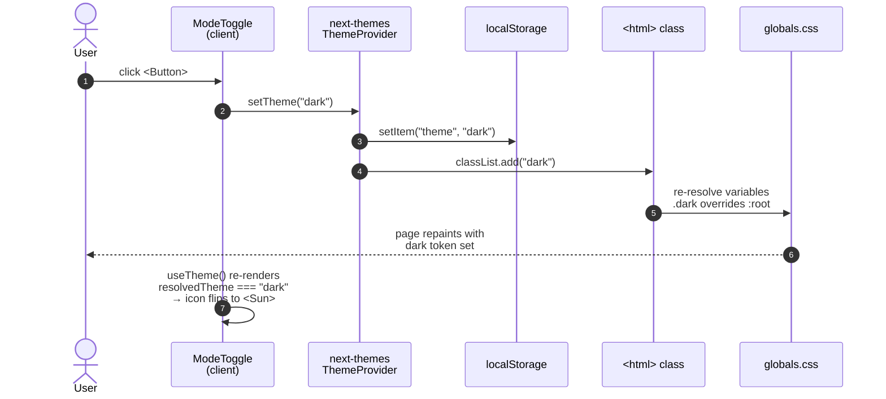
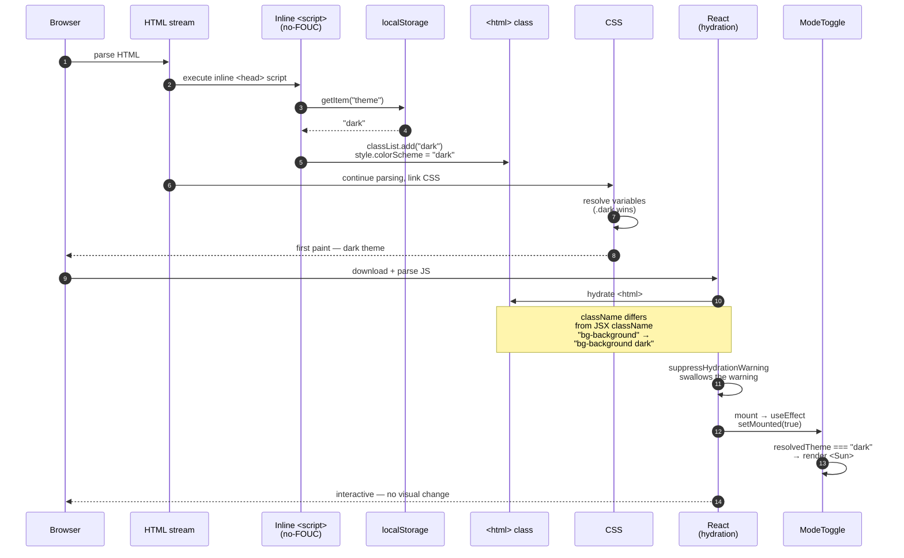

# Design: dark-mode

**Status**: `design`
**Date**: 2026-06-02
**Author**: Sub-agent `sdd-design`
**Project key**: `b_TTzk1b8KwYH` (romina-web)
**Proposal**: `openspec/changes/dark-mode/proposal.md`
**Implementation budget**: `~100 changed lines`, band `<200` — single PR.

---

## Open questions resolved

### Q1 — `<meta name="color-scheme">` alongside `theme-color`?

**Decision: YES** — `colorScheme: 'light dark'` + `themeColor` array in a new `viewport` export.

`color-scheme` is the browser-native hint that themes form controls, scrollbars, and the canvas ([MDN](https://developer.mozilla.org/en-US/docs/Web/HTML/Element/meta/name/color-scheme)). Without it, inputs render against the OS light scheme, producing a visible mismatch in dark mode. Combined with the `themeColor` work, the cost is zero extra lines.

### Q2 — No-FOUC script: `next/script beforeInteractive` vs inline `dangerouslySetInnerHTML`?

**Decision: inline `<script dangerouslySetInnerHTML={{ __html: '…' }} />` inside a new explicit `<head>` element.**

1. **Synchronous parse** — a bare `<script>` runs before first paint; `<Script strategy="beforeInteractive">` can land after the first frame in some hydration paths.
2. **Zero extra request** — the script is ~150 bytes.
3. **next-themes' own docs use this pattern** — see [the README](https://github.com/pacocoursey/next-themes#avoid-hydration-mismatch).
4. **Mirrors the resolved theme to `style.colorScheme` instantly** — the `viewport` hint is fixed, the inline script is per-render.

**Correction to the proposal sketch**: Next.js App Router does NOT auto-place sibling elements of `<html>` into `<head>`. To inject a `<script>` into `<head>`, the JSX must explicitly declare a `<head>` block; the framework-generated `<head>` content (from `metadata`/`viewport`) coexists with it. Pattern:

```tsx
<html lang="es" className="bg-background" suppressHydrationWarning>
  <head><script dangerouslySetInnerHTML={{ __html: NO_FOUC_SCRIPT }} /></head>
  <body>…</body>
</html>
```

### Q3 — Provider order: TooltipProvider outside, ThemeProvider inside?

**Decision: TooltipProvider OUTSIDE, ThemeProvider INSIDE**.

`TooltipProvider` (Radix) is theme-agnostic; keeping it outside means existing tooltips keep working if the theme provider is ever swapped. The `ThemeProvider` only needs to wrap `useTheme()` consumers: the new `ModeToggle` and `components/ui/sonner.tsx` (which calls `useTheme()` today with no provider mounted — silent bug, fixed as a side effect).

`enableSystem={false}` is set explicitly. Without it, `next-themes` defaults to `true`, meaning a returning user with a stale `localStorage.theme === 'system'` value from a future migration would get OS-driven theming — a contract leak for a 2-option toggle.

---

## Architecture overview

```
<html lang="es" className="bg-background" suppressHydrationWarning>
  <head>
    <script dangerouslySetInnerHTML={{ __html: NO_FOUC_SCRIPT }} />
  </head>
  <body className="font-sans antialiased">
    <a href="#main-content">…</a>          ← skip link
    <TooltipProvider>                       ← theme-agnostic
      <ThemeProvider                         ← next-themes
        attribute="class"
        defaultTheme="light"
        enableSystem={false}
        disableTransitionOnChange
      >
        <Header>        <ModeToggle />      ← desktop nav + mobile sheet
        <Organizations> … bg-foreground*    ← dots swap
        <Toaster />     … useTheme() now works
        {children}
      </ThemeProvider>
    </TooltipProvider>
    <script>ld+json x2</script>
    <Analytics />
  </body>
</html>
```

The `.dark` class on `<html>` is the single switch: `app/globals.css:4` (`@custom-variant dark (&:is(.dark *))`) inverts the token set — `:root` provides light tokens, `.dark` overrides them, and `@theme inline` maps both into Tailwind utilities (`bg-background`, `text-foreground`, `bg-card`, `bg-primary`, …). No component-level `dark:` overrides are required except the 3 lines in `components/organizations.tsx` and the `bg-white` thumb in `components/ui/slider.tsx` (out of scope, see proposal).

---

## Component design — `ModeToggle`

**New file**: `components/theme-toggle.tsx` (kebab-case, sections dir per `openspec/AGENTS.md` §2 — NOT `components/ui/`, since this is not a shadcn primitive).
**Exported name**: `ModeToggle` (matches shadcn docs convention; `header.tsx` imports `import { ModeToggle } from '@/components/theme-toggle'`).

```tsx
"use client"
import * as React from "react"
import { Moon, Sun } from "lucide-react"
import { useTheme } from "next-themes"
import { Button } from "@/components/ui/button"

export function ModeToggle() {
  const { resolvedTheme, setTheme } = useTheme()
  const [mounted, setMounted] = React.useState(false)
  React.useEffect(() => { setMounted(true) }, [])

  // resolvedTheme is `undefined` until mount (next-themes defers hydration);
  // gate on `mounted` so SSR and first client render produce identical HTML.
  const isDark = mounted && resolvedTheme === "dark"

  return (
    <Button
      variant="ghost" size="icon"
      onClick={() => setTheme(isDark ? "light" : "dark")}
      aria-label={isDark ? "Cambiar a tema claro" : "Cambiar a tema oscuro"}
      aria-pressed={isDark}
      className="rounded-xl"
    >
      {isDark
        ? <Sun aria-hidden suppressHydrationWarning />
        : <Moon aria-hidden suppressHydrationWarning />}
    </Button>
  )
}
```

### Decision log + state machine

| Decision | Choice | Rationale |
|----------|--------|-----------|
| File path | `components/theme-toggle.tsx` | Sections dir per `openspec/AGENTS.md` §2 (not a shadcn primitive). |
| Export name | `ModeToggle` | Matches shadcn docs. |
| `"use client"` | Required | `useTheme` + `useState`/`useEffect`. |
| Hardcoded `variant="ghost" size="icon"` | Yes | Single-instance affordance; YAGNI for prop-driven API. |
| `rounded-xl` | Yes | Matches existing nav buttons (`header.tsx:354, :420, :463`). |
| `aria-pressed` (not `role="switch"`) | `aria-pressed` | Canonical for a `Button` that flips a binary state. `role="switch"` is for `Switch`-styled controls. |
| `aria-label` (Spanish, imperative) | "Cambiar a tema claro/oscuro" | Says what the click WILL do. Screen-reader convention for toggle buttons. |
| `mounted` gate | Required | `resolvedTheme` is `undefined` until mount; without the gate, SSR vs first client render would mismatch. |
| Placeholder before mount | `Moon` | Matches SSR output (`mounted === false` ⇒ `isDark === false` ⇒ Moon). SSR-deterministic. |
| `suppressHydrationWarning` on icon | Yes | Belt-and-suspenders for `next-themes` mutating `<html>` before hydration. |
| Icon size | Implicit | `Button` line 8: `[&_svg:not([class*='size-'])]:size-4`. `size-4` inside `size-9` = 1rem padding. |
| `aria-hidden` on icon | Yes | `Button` has the accessible name via `aria-label`; icon is decorative. |
| Focus ring | Inherits from `Button` | `focus-visible:ring-ring/50` uses the same turquoise in both themes. |

| State | `mounted` | `resolvedTheme` | Icon | `aria-label` | `aria-pressed` | Click effect |
|-------|-----------|-----------------|------|--------------|----------------|--------------|
| SSR (first paint) | `false` | `undefined` | `Moon` | "Cambiar a tema oscuro" | `false` | no-op until mount |
| Mounted, light | `true` | `"light"` | `Moon` | "Cambiar a tema oscuro" | `false` | `setTheme("dark")` |
| Mounted, dark | `true` | `"dark"` | `Sun` | "Cambiar a tema claro" | `true` | `setTheme("light")` |

The click being a no-op before mount is acceptable: `next-themes` mounts in the same React tree, and the user cannot realistically click a button that has been visible for < 1 frame.

---

## `app/layout.tsx` change

Four additive edits, applied in this order:

```diff
@@ imports @@
- import type { Metadata } from 'next'
+ import type { Metadata, Viewport } from 'next'
  import { TooltipProvider } from '@/components/ui/tooltip'
+ import { ThemeProvider } from '@/components/theme-provider'
  // …existing imports unchanged

+ // Top-of-file constant — see §No-FOUC script for the byte-by-byte rationale
+ const NO_FOUC_SCRIPT = `(function(){try{var t=localStorage.getItem('theme');if(!t){t='light'}var d=t==='dark';document.documentElement.classList[d?'add':'remove']('dark');document.documentElement.style.colorScheme=t}catch(e){}})()`

@@ metadata block @@
  export const metadata: Metadata = { … }
+
+ export const viewport: Viewport = {
+   themeColor: [
+     { media: '(prefers-color-scheme: light)', color: '#ffffff' },
+     { media: '(prefers-color-scheme: dark)',  color: '#0a0a0a' },
+   ],
+   colorScheme: 'light dark',
+ }

@@ RootLayout return @@
  return (
-   <html lang="es" className="bg-background">
+   <html lang="es" className="bg-background" suppressHydrationWarning>
+     <head>
+       <script dangerouslySetInnerHTML={{ __html: NO_FOUC_SCRIPT }} />
+     </head>
      <body className={`${lora.variable} ${nunito.variable} font-sans antialiased`}>
        <a href="#main-content" className="sr-only focus:not-sr-only …">…</a>
-       <TooltipProvider>{children}</TooltipProvider>
+       <TooltipProvider>
+         <ThemeProvider
+           attribute="class"
+           defaultTheme="light"
+           enableSystem={false}
+           disableTransitionOnChange
+         >
+           {children}
+         </ThemeProvider>
+       </TooltipProvider>
        <script type="application/ld+json" …>…</script>
        <script type="application/ld+json" …>…</script>
        <Analytics />
      </body>
    </html>
  )
```

`colorScheme: 'light dark'` is the Q1 decision. The `themeColor` hex values are approximate sRGB stand-ins for the OKLCH tokens in `globals.css:8` (≈ near-white) and `:112` (≈ near-black). Limitation: `theme-color` follows the OS via `prefers-color-scheme`, not the in-app theme — documented in §Tradeoffs.

**Untouched**: `metadata.icons` (the existing `icon-light-32x32.png` / `icon-dark-32x32.png` for favicons, lines 48-60) — already gates on `prefers-color-scheme`, still correct. The two `application/ld+json` scripts at the end of `<body>` — they don't touch `<html>`'s class, no conflict with `suppressHydrationWarning`.

---

## Header integration

**File**: `components/header.tsx` (modify, +7 lines). One import + two insertion points.

```diff
@@ imports (near the other section component imports, ~line 30) @@
  import { Button } from "@/components/ui/button";
  import { Separator } from "@/components/ui/separator";
+ import { ModeToggle } from "@/components/theme-toggle";

@@ Desktop nav (line 350) — between Separator and CTA @@
        <Separator orientation="vertical" className="mx-2 h-5" />
+       <ModeToggle />
        {/* CTA */}
        <Button asChild size="sm" …><Link href="#contacto">Contacto</Link></Button>

@@ Mobile sheet footer (line 458) — above CTA, centered @@
        <div className="border-t bg-background p-4">
+         <div className="mb-3 flex justify-center">
+           <ModeToggle />
+         </div>
          <SheetClose asChild>
            <Button asChild className="w-full rounded-xl …">
              <Link href="#contacto">Agenda tu sesión</Link>
            </Button>
          </SheetClose>
        </div>
```

**Position rationale**:

- **Desktop**: between `Separator` and "Contacto" CTA. Flex parent uses `gap-1` (`header.tsx:289`); no extra `margin`/`padding` needed. Focus ring intensity is identical in both themes.
- **Mobile**: above "Agenda tu sesión" CTA, centered. Wrapper `<div>` uses `mb-3` to preserve the original vertical rhythm; `flex justify-center` reads as a "settings" affordance distinct from left-aligned nav items. Same `Button` variant — no special mobile-only styling.

No prop drilling. `ThemeProvider` already wraps the entire `Header` via the layout.

---

## `components/organizations.tsx` change

**File**: `components/organizations.tsx` (modify, lines 215-219 inside the dot rendering block).

```diff
              {/* Dots */}
              <div className="absolute bottom-4 left-1/2 -translate-x-1/2 flex gap-2">
                {images.map((_, index) => (
                  <button
                    key={index}
                    onClick={() => goToSlide(index)}
                    aria-label={`Ir a imagen ${index + 1} de ${images.length}`}
                    className={`w-2 h-2 rounded-full transition-all duration-300 ${
                      index === currentIndex
-                       ? "bg-white w-6"
-                       : "bg-white/50 hover:bg-white/70"
+                       ? "bg-foreground w-6"
+                       : "bg-foreground/50 hover:bg-foreground/70"
                    }`}
                  />
                ))}
              </div>
```

Three `bg-white*` tokens → three `bg-foreground*` tokens across 2 lines (`bg-white/70` shares a line with `bg-white/50`).

**Tradeoff note**: `bg-foreground` is the *text* color, not the *background* color. In light mode it is a dark turquoise/charcoal; in dark mode a near-white. Dots become the inverse of the surrounding text — the desired UX (dots = "ink", image = "paper"). A future design pass can introduce a dedicated `--dot` token if a different contract is needed. Out of scope for this change.

---

## No-FOUC script — final body and placement

```ts
const NO_FOUC_SCRIPT = `(function(){try{var t=localStorage.getItem('theme');if(!t){t='light'}var d=t==='dark';document.documentElement.classList[d?'add':'remove']('dark');document.documentElement.style.colorScheme=t}catch(e){}})()`
```

**Byte-by-byte justification**:

| Fragment | Purpose |
|----------|---------|
| `(function(){…})()` | IIFE — local scope, no globals. |
| `try{…}catch(e){}` | Safari private mode + iframe sandboxes throw on `localStorage`. Fail silently. |
| `getItem('theme')` | `next-themes` default `storageKey` is `'theme'`. |
| `if(!t){t='light'}` | If nothing persisted, fall through to light (matches `defaultTheme="light"`). |
| `classList[d?'add':'remove']('dark')` | The class toggle. Only `dark` is mutated; absence = light (matches `attribute="class"`). |
| `style.colorScheme=t` | Inline CSS hint — first paint already has the right scrollbar/canvas color. |

**Placement**: top-of-file string constant in `app/layout.tsx`, rendered via `dangerouslySetInnerHTML` inside a `<script>` that is a direct child of a new explicit `<head>` element (App Router requires the explicit `<head>`; see Q2 resolution). The script tag has no `id`, no `src`.

**Before-paint contract**: the script runs synchronously during HTML parsing, before `<body>` is constructed. By the time the parser reaches `<body>`, `<html>` already has the right class. React's hydration sees `class="bg-background dark"` on the DOM vs `className="bg-background"` in the JSX → `suppressHydrationWarning` swallows the warning.

---

## Side effects

**1. `components/ui/sonner.tsx` — silent bug fix.** Line 3 calls `useTheme()` from `next-themes`. Today (no provider mounted) `useTheme()` returns `{ theme: undefined, … }`, so the destructure defaults to `'system'`. `sonner` renders toasts in `'system'` mode (OS fallback) — may not match the page. After this change, `useTheme()` returns the real theme and the toast in `/generador` matches. Free fix; the provider mount is the fix. Document in the verification step.

**2. `<html>` hydration warning suppression.** `suppressHydrationWarning` is required by `next-themes` to silence the className mismatch that the no-FOUC script + provider cause. Runtime behavior unaffected.

**3. TooltipProvider / ThemeProvider interaction.** `TooltipProvider` (Radix) is theme-agnostic. The existing tooltip classes use `bg-foreground text-background` (`components/ui/tooltip.tsx:49`), which are semantic tokens that auto-adapt — tooltips remain readable in both themes.

---

## Tradeoffs

| Decision | Picked → Rejected | Tradeoff |
|----------|-------------------|----------|
| Toggle options | 2 (Claro/Oscuro) → 3 (con "Sistema") | One-time loss for any returning user with `system` as effective theme — reset to `light`. Acceptable: zero users in production. |
| `defaultTheme` | `"light"` → `"system"` | Returning dark users on first visit see a flash of light (no-FOUC only applies *persisted* themes). Acceptable: first-visit users haven't expressed a preference. |
| `attribute` | `"class"` → `"data-theme"` | `@custom-variant dark (&:is(.dark *))` (`globals.css:4`) binds to `.dark`. Switching requires a global CSS rewrite. Locked-in. |
| `enableSystem` | `false` (explicit) → `true` (default) | Forces 2-option contract. A `localStorage.theme = 'system'` pastes → no-op → light. Acceptable. |
| `disableTransitionOnChange` | `true` → `false` | Avoids the variable-transition mid-tick flash. Cost: ~250 ms of disabled transitions after a click. Acceptable: user is focused on the toggle. |
| `<meta name="theme-color">` source | `prefers-color-scheme` → in-app reflection | Mobile browser chrome follows the OS, not the toggle. In-app reflection needs a second client script. Out of scope. |
| `themeColor` colors | `#ffffff` / `#0a0a0a` → exact OKLCH | Difference between `#ffffff` and `oklch(0.98 0.005 200)` (≈ `#f7fafb`) is imperceptible. OKLCH conversion adds noise. |
| No-FOUC mechanism | inline `<script>` → `<Script strategy="beforeInteractive">` | Inline is synchronous, matches the next-themes reference. Cost: `dangerouslySetInnerHTML` is mildly gross. Benefit: no-FOUC contract is unconditional. |
| `ModeToggle` API | hardcoded `variant`/`size` → prop-driven | Single-instance affordance. Prop-driven would be YAGNI. |
| `aria-label` granularity | Spanish, imperative ("Cambiar a …") → "Tema claro/oscuro" (state) | Imperative form is the accessible-name convention for toggle buttons. |
| `<head>` placement | explicit `<head>` in JSX → auto-generated | Auto-generated `<head>` only carries metadata outputs; custom elements need an explicit `<head>`. |

---

## Sequence diagrams

### Diagram 1 — User clicks the toggle



### Diagram 2 — First paint with persisted dark theme



---

## Performance & build

| Concern | Impact | Mitigation |
|---------|--------|-----------|
| `ModeToggle` bundle | `< 1 KB gz` | `useTheme` already in the `next-themes` chunk (used by `sonner.tsx`); `Moon`/`Sun` are tree-shakeable `lucide-react` exports, already in the header bundle. |
| no-FOUC script | 0 KB external | Inline; no extra request. |
| CLS / LCP | None | Toggle is `size-9`; icon swap doesn't shift layout. Header isn't on the critical render path. |
| First paint | No regression | The inline script is the only new first-paint work; runs synchronously. |
| `disableTransitionOnChange` | Skips CSS transitions ~250 ms after a click | Intentional — avoids the variable-transition mid-tick flash. |
| `typescript.ignoreBuildErrors: true` | Build passes even with type errors | `sdd-verify` MUST run `npx tsc --noEmit` separately. |
| React Compiler | Compatible | `next-themes` uses standard `useState`/`useEffect`; no manual memoization in `ModeToggle`. |

---

## Rollback

Already specified in the proposal: `git revert` of the single commit (or `reset --hard HEAD~1` if not pushed). No data migration, no feature flag, no schema change. The change is purely additive over the existing CSS variables. State at worst: `localStorage.theme` set to `"dark"` for a returning user — cleared with DevTools.

---

## Open questions for the spec phase

`Sdd-spec` should answer these when writing the delta to `openspec/changes/dark-mode/specs/landing-page-romina/spec.md` (the `R4`/`R5` requirements named in the proposal):

1. **R4 acceptance criteria** — what is the testable definition of "dark mode works"?
   - Click toggle → `document.documentElement.classList` includes `dark`.
   - Persists across page reload via `localStorage.theme`.
   - Applies on the *next* cold-start page load without a click.
2. **R5 acceptance criteria** — what is the testable definition of "no FOUC"?
   - A user with `localStorage.theme === "dark"` who hard-reloads sees the dark theme on first paint, no flash of light.
   - A user with no `localStorage.theme` sees the light theme on first paint.
   - Both must hold with JS disabled in DevTools and JS enabled.
3. **Scenario shape** — one composite scenario with both directions, or two scenarios (one per direction)? Recommend one composite.
4. **No-FOUC under degraded environments** — when `localStorage` throws (Safari private mode), expected behavior: fall through to light, accept the FOUC as documented degradation. Private-mode users accept these trade-offs.

No other open questions. The design is complete; `sdd-tasks` can write a `tasks.md` of ~12-15 atomic tasks from the file changes in §File Changes below.

---

## File changes summary

| File | Action | Lines | Description |
|------|--------|-------|-------------|
| `components/theme-toggle.tsx` | Create | ~35 | `ModeToggle` client component (`useTheme` + `Button` + lucide icons). |
| `app/layout.tsx` | Modify | +20 / -3 | Import `ThemeProvider`, declare `viewport` export, add `<head>` with no-FOUC script, wrap `{children}` in `ThemeProvider` inside `TooltipProvider`, add `suppressHydrationWarning` to `<html>`. |
| `components/header.tsx` | Modify | +7 | Import `ModeToggle`, render in desktop nav (between `Separator` and CTA) and mobile sheet footer (above CTA). |
| `components/organizations.tsx` | Modify | 3 token swaps across 2 lines | `bg-white*` → `bg-foreground*` in carousel dots. |

**Total**: ~65 net additions, 3 token swaps. Band `<100`, well below the 400-line review budget. Single PR. Chained PR not recommended.

---

## Verification (for `sdd-verify`)

Since `strict_tdd: false`:

1. `npx tsc --noEmit` — must pass (catches `useTheme` import, `Viewport` type).
2. `pnpm lint` — must pass.
3. `pnpm build` — must succeed.
4. Manual smoke on `/`:
   - First visit, no `localStorage.theme` → light; toggle visible in header.
   - Click → page flips to dark; icon swaps to Sun.
   - Hard-reload → still dark; no flash of light.
   - DevTools → `localStorage.theme === "dark"`, `<html class="bg-background dark">`.
5. Manual smoke on `/generador`: trigger a toast → matches current theme (verifies the silent `sonner.tsx` fix).
6. Optional Lighthouse before/after — no regression expected (toggle is off the critical path).
